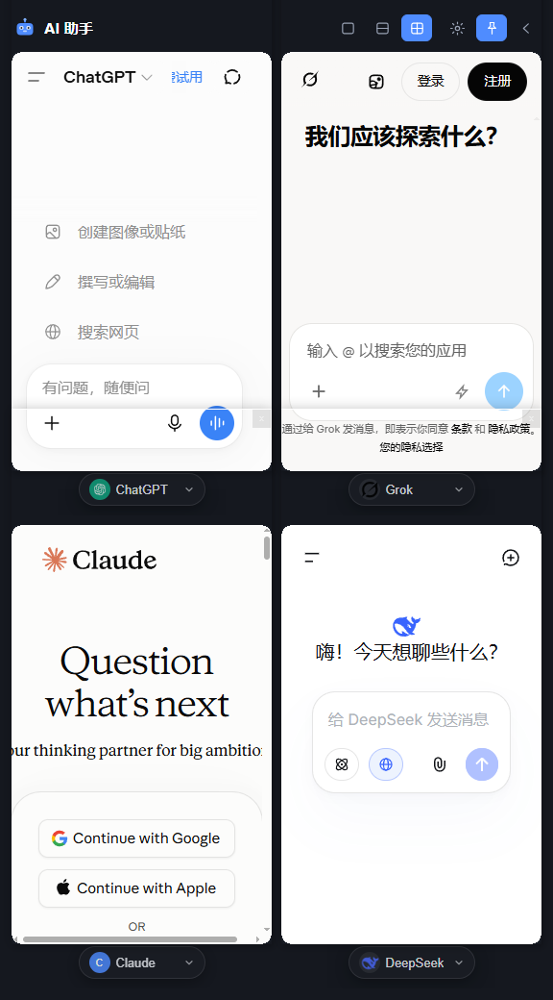
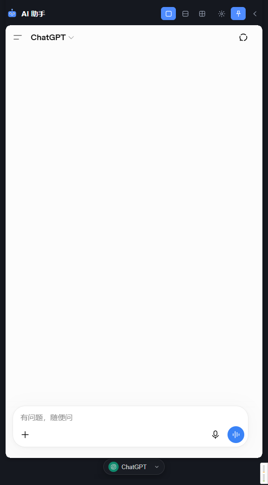

# AI 多开助手（AIQuad）

[](LICENSE)

一个 AI 快捷调用工具：在任何地方都能快捷键呼出贴边面板，同时和 1~4 个 AI 对话，1/2/4 分格同开、多 AI 便捷切换、支持分 AI 代理分流。

## 为什么用它

用 AI 的麻烦，多半出在两件事上：够不着，和切来切去。

想问一句，得先切回桌面，在一堆浏览器标签里翻出那个页面；想换一家 AI 再问，又得另开窗口，
或者另开一个程序；两家的答案想对着看，只能反复 `Alt+Tab`，看两眼就忘了上一句说的是什么。

AIQuad 就是做这个的。

- **`Alt+Space` 呼出，再按一下收起**，不用回桌面找浏览器，也不用在标签里翻。
- **面板默认贴屏幕右侧**，占 30% 屏宽、满屏高。左边照常写代码、写文档、看资料，不用来回切窗口。
- **位置和宽度都能调**，左停还是右停、20% 到 60% 的宽度，拖动滑块即时生效。
- **每格底部一个 AI 切换器**，按国外 / 国内分好组，点一下换掉，不用重开窗口，也不用重新登录。
- **四格可以同开**，同一句话分别问 ChatGPT、Gemini、Claude、DeepSeek，答案并排摆着，
  比来回复制粘贴省事。
- **登录一次就够**，所有分格共用一份浏览器档案，任意一格登录过，其它格切到同一站点直接就是登录态。

### 几个典型场景

| 场景 | 怎么用 |
|---|---|
| 对照选型 / 交叉求证 | 同一个问题四格同开，让不同 AI 各答一遍，别被单独一家的说法带偏 |
| 边写代码边问 | 面板贴右侧，左边 IDE 照常写，右边直接问报错是什么意思 |
| 长文写作分工 | 一格列提纲、一格写正文、一格挑毛病，各占一格，切换任务不用换窗口 |
| 结论接力 | 上一格问到的结论丢进下一格，换个模型接着深化，上下文各自留在窗口里 |
| 多账号 / 多语种 | 关掉「登录态共享」后每格是独立档案，可以同时挂两个账号，或者中英对照 |

## 技术上的不同

同类工具（比如 `rtugeek/ai` 这种用 Electron 内嵌 webview 的做法）是把 AI 网页塞进内嵌浏览器里跑，
我们反过来，驱动真实的 Chrome / Edge：

> 每个分格都是一个真正的浏览器窗口，登录态能持久保存，也能跨分格共享。
> 在 2 格登录过的 Gemini，1 格切过去就是登录状态。

---

## 界面与交互

呼出之后，面板是贴在屏幕一侧的竖长条（默认在右侧，30% 屏宽，满屏高），
上面一行是标题栏和按钮，下面按你选的分格方式铺开。

**2×2 四格布局**，四格分别是 ChatGPT / Grok / Claude / DeepSeek：



**单页布局**，贴右侧，左边照常干活：



- **顶栏**：单页 / 上下两格 / 四格、设置、置顶、收起。按住顶栏能临时把面板挪个位置。
- **每格底部**：居中的 AI 切换器，平时半透明，鼠标移上去变清晰，点开是按国外 / 国内分组的列表。
- **快捷键设置**：在设置页点一下输入框，直接按下组合键就抓到了，顺序和大小写会自动规范。
  必须带 `Ctrl` / `Alt` / `Win` 之一，`F1`–`F24` 和音量、媒体键可以单用。`Shift` + 字母不支持，
  那会把全局打字键抢走。语法不合法、被别的程序占用、和本应用其它快捷键撞车，都会当场提示。
- 面板是竖长条，只提供 1 / 2 / 4 三种分格。三段式在竖长面板里每格太扁，不好用。

## 功能

| 功能 | 说明 |
|------|------|
| 多 AI 切换 | 内置 ChatGPT / Gemini / Grok / Claude / Perplexity / DeepSeek / Kimi / 通义千问 / 豆包 / 元宝 / 智谱清言，可以自己加 |
| 1/2/4 窗口同开 | 单页 / 上下两格 / 2×2 四格，每格独立选 AI，登录态在所有分格间共享 |
| 快捷键呼出 | 默认 `Alt+Space` 呼出和收起，带滑动动画；`Ctrl+Alt+1/2/4` 切分格数 |
| 快捷键抓取设置 | 设置页里点一下输入框，直接按组合键自动抓取，不用手打 `Ctrl+Alt+1` 这种字符串 |
| 代理设置 | 跟随系统 / 自定义（HTTP、HTTPS、SOCKS5）/ 直连。共享会话下是进程级设置，只能全局 |
| 面板位置与宽度 | 停靠屏幕左或右，宽度 20%~60% 滑块，拖动实时预览 |
| 托盘常驻 | 关掉面板不退出，托盘菜单可以呼出、收起、进设置、退出 |
| 登录态持久 | 所有分格共用一份浏览器档案，登录一次到处可用，关掉重开免登录 |

## 原理

不把网页塞进内嵌浏览器，而是驱动真实的 Chrome / Edge 进程，再用 Win32 的「顶级窗口 + 属主关系」
把浏览器窗口精确覆在分格内容区上。登录态因此天然共享，键盘输入和中文输入法都正常，
站点那边看到的也只是个普通浏览器窗口。

架构图、0px 对齐是怎么做到的、四个 Win32 技巧、防站点风控的实测依据和验证数据，
见 [docs/how-it-works.md](docs/how-it-works.md)。

## 运行与开发

```bash
npm install
npm run build     # 编译 TypeScript
npm run dev       # 启动应用
npm run dist      # 打包 NSIS 安装包（输出到 build/）
```

配置和浏览器档案都在 `%APPDATA%\aiquad\` 下（`config.json` 和 `profiles/`），设置页可以直接打开档案目录。

容器、虚拟机这类受限环境下的 GPU 自动降级开关，以及全部自检脚本，同样见
[docs/how-it-works.md](docs/how-it-works.md)。

## 已知限制

- 代理是进程级设置。开启「登录态共享」时所有分格共用一个浏览器进程，只能走全局代理；
  要按 AI 分别走代理，得在设置页关掉「登录态共享」。
- 「后台分格休眠」在共享会话下降级为隐藏窗口，因为挂起进程会把所有分格一起冻住，做不到只挂起一格。
- 关掉「登录态共享」后，每个分格是一个独立浏览器进程，4 格全开会占用较多内存。
- 改代理、窗口形态、共享开关需要重启浏览器实例。设置页保存时会等旧进程真正退出再重启。
- 浏览器窗口是独立的原生窗口，没法跟 Electron 的页面做层叠。浮层（AI 下拉）只能靠"挖洞"让位，
  而且浮层出不了一格的边界。
- 分格宽度小于 270px 左右时，部分站点（比如 ChatGPT）自己会切到窄屏版式，这是站点行为。
- 站点自己的弹层（比如 Gemini 的模型选择器）如果超出一格的范围，会被格子边界裁掉。

## 致谢与参考

### 对标项目

立项时我们拿 [`rtugeek/ai`](https://github.com/rtugeek/ai)（「桌面组件 Widgets」里的 AI 组件包）
当对照对象。它用 Electron 内嵌 `<webview>` / BrowserView 加载 AI 网页，我们分析过它为什么会被
Google 判定成"应用内嵌浏览器"，最后选了相反的路线：不内嵌网页，直接驱动真实的 Chrome / Edge 进程。

> **本项目没有使用 `rtugeek/ai` 的任何源代码。** 它只是被当成"要避开的设计"来参考，
> 所以本项目不受它 GPL-2.0 许可的约束。在这里提一下，一是说明技术选型是怎么来的，
> 二是对先行者的尊重。

### 第三方依赖

| 依赖 | 用途 | 许可证 |
|---|---|---|
| [Electron](https://github.com/electron/electron) | 桌面壳：主进程 / 面板窗口 / 托盘 | MIT |
| [koffi](https://github.com/Koromix/koffi) | Node.js 调用 Win32 API（`user32` / `gdi32`） | MIT |
| [TypeScript](https://github.com/microsoft/TypeScript) | 开发语言 | Apache-2.0 |
| [electron-builder](https://github.com/electron-userland/electron-builder) | 打包 NSIS 安装包 | MIT |

### 图标

`src/renderer/assets/` 下的 AI 站点图标只用来标识跳转目标，
版权和商标归各自品牌方所有（OpenAI、Google、xAI、Anthropic、Perplexity、
DeepSeek、月之暗面、阿里云、字节跳动、腾讯、智谱 AI）。

## 许可证

[MIT](LICENSE) © 2026 WW-Ares 与 AI 协作
